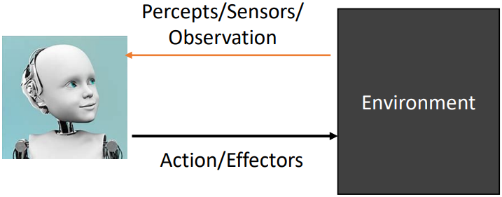

# Week03-AI Concept and Agent

- AI（Artificial Intelligence）的定义（Definition）
  - intelligence: The ability to ..., ..., ..., ... new situations
    - learn: 学习
    - understand：理解
    - deal with：应对
    - try：尝试
  - AI在各种字典中的定义
    - dictionary.com: computer, analogous to **learning and decision making**
    - Wikipedia: branch of CSE, deal with intelligent **behavior, learning and adaptation**
    - 第一本AI书籍: the study of how to make computers do things which, at the moment, **people do better**
  - Pioneers的定义
    - Every aspect of learning or any other feature of intelligence can in principle be so precisely described that **a machine can be made to simulate it**.
    - make intelligent machines, use computers to **understand human intelligence**, but AI doesn't have to confine itself to methods that are biologically observable. 
- AI的分类（Categories）
  - 符号主义
    - 逻辑主义、心理学派和计算机学派
    - 主要组成：数理逻辑、专家系统、知识工程
    - **智能是由人赋予的**
  - 连接主义
    - 仿生学派、生理学派
    - 主要组成：人工神经元、感知机、BP神经网络、深度神经网络
    - **智能是机器自己学习出来的**
  - 行为主义
    - 进化主义、控制论学派
    - 主要组成：强化学习、机器人科学
    - **智能是从环境的反馈中学习出来的**
- 从CS的角度理解计算机：AI是生产具有智能的机器和软件的CS的一种分支学科
- AlphaGo: [AlphaGo完整纪录片](https://www.bilibili.com/video/av456221765/)
- Agent:
  - 智能体，任何可以通过传感器（sensor）感知环境，并通过效应器（effector）作用于环境（environment）的功能
  - 
  - 人类智能体的sensor有眼耳鼻舌皮肤等，effectors有手腿口等等；机器人智能体的sensor有相机和红外测距等，effector有各种电机和执行器；程序智能体的sensor有编码的位串作为它的程序和动作。
  - 强化学习五要素：agent、state、action、reward、environment
- AI的组成部分：
  - 感知环境：观察和理解环境
  - 采取行动
  - 最大化成功的可能性