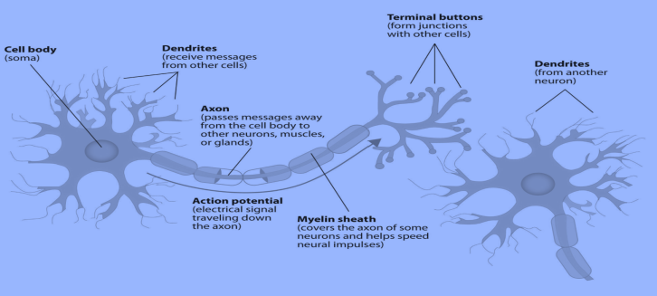

# Week06-Perceptron and Hebb's Law

- 从人眼到人脑的视觉信息：
  - 一百万个ganglion cells：位于视网膜末端的神经细胞，接受来自视网膜的信号，产生动作电位
  - 1.4亿个V1神经元：视觉初级区，第一阶段，从丘脑外侧膝状核(LGN)接收主要的视觉输入，并将其主要输出发送到随后的皮层视觉区

- 人类视觉信号传递过程：

  - Retina: 视网膜（视网膜的十层结构）
  - V1: Edge detection, etc.
  - V2: Extract simple visual properties (orientation, spatial frequency, color, etc.)
  - V4: Detect object features of intermediate complexity
  - IT: Object recognition

- 电子人脑：

  - 人类神经元：树突 ----- 细胞体 ----- 轴突 ----- 下一个神经元的树突

    

  - 人工神经元：输入 ----- 权重 ----- 求和 + bias ----- 激活函数 ----- 输出

    

  - MCP (McCulloch and Pitts) Neuron: 权重人为调整而并非通过学习

    

  - 此处的激活函数为
    $$
    g(z) = \begin{cases}
    1, & z\geq0 \\
    0, & otherwise
    \end{cases}
    $$

- Turing Test 图灵测试

